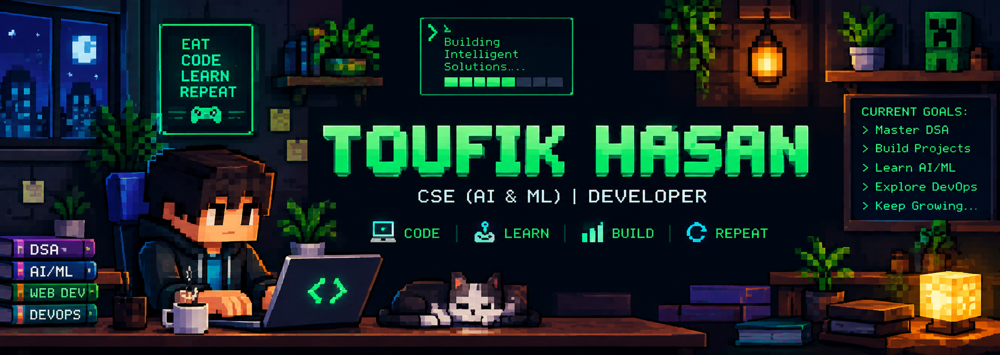

<!-- ========================================================= -->
<!--                    TOUFIK HASAN PROFILE                    -->
<!--             PIXEL / RETRO DEVELOPER README                 -->
<!-- ========================================================= -->

  

  

  
  
  
  

  

---

# 👋 Hey, I'm Toufik

  

I'm a **B.Tech Computer Science & Engineering student specializing in AI & ML**, passionate about building intelligent systems, solving problems and turning ideas into practical software.

### 🧑‍💻 About Me

- 🎓 Computer Science & Engineering — **AI & ML**
- 🤖 Exploring **Artificial Intelligence & Machine Learning**
- 🧠 Practicing **Data Structures & Algorithms**
- 🌐 Learning **Full Stack Development**
- ⚙️ Exploring **DevOps, CI/CD & Cloud**
- 📊 Exploring **Data Analytics**
- 🚀 Building real-world projects
- 🏆 Participating in hackathons
- 💡 Interested in solving real-world problems with technology

---

# 🕹️ DEVELOPER PROFILE

<table align="center">
<tr>

<td align="center" width="220">

### 🧠

**DSA**

Problem Solving

</td>

<td align="center" width="220">

### 🤖

**AI / ML**

Intelligent Systems

</td>

<td align="center" width="220">

### 🌐

**FULL STACK**

Web Applications

</td>

<td align="center" width="220">

### ⚙️

**DEVOPS**

Cloud & CI/CD

</td>

</tr>
</table>

---

# 🌱 CURRENTLY LEARNING

---

# 🛠️ TECH STACK

## 💻 Programming Languages

## 🌐 Frontend & Backend

## 🤖 AI / Machine Learning

## ⚙️ Tools, Cloud & DevOps

---

# 🚀 FEATURED PROJECTS

<table>
<tr>

<td width="50%" valign="top">

## 🛰️ Landslide Risk Monitoring System

AI-powered early-warning and risk-monitoring platform for landslide-prone regions.

### 🔧 Technologies

`Python` `Machine Learning` `React` `GIS`

### ⚡ Features

🌧️ Rainfall Analysis

🛰️ Satellite Data

🌱 Soil Monitoring

🤖 Risk Prediction

🚨 Early Warning

🗺️ GIS Visualization

📍 Vulnerable Area Detection

</td>

<td width="50%" valign="top">

## 🌾 Smart Farmer & Soil Management

AI-powered agriculture and soil management platform.

### 🔧 Technologies

`React` `Python` `AI/ML`

### ⚡ Features

🌱 Crop Recommendation

🦠 Disease Detection

🌦️ Weather Alerts

🐛 Pest Prediction

📊 Farm Analytics

📈 Crop Growth Tracking

🤖 AI-Based Recommendations

</td>

</tr>
</table>

---

# 🏆 HACKATHON JOURNEY

💡 <b>IDEATE</b>
&nbsp; → &nbsp;
🔎 <b>RESEARCH</b>
&nbsp; → &nbsp;
💻 <b>BUILD</b>
&nbsp; → &nbsp;
🧪 <b>TEST</b>
&nbsp; → &nbsp;
🚀 <b>HACK</b>
&nbsp; → &nbsp;
🎯 <b>PRESENT</b>

### 🔥 Areas I Love Building In

---

# 📊 GITHUB STATS

---

# 📈 CONTRIBUTION GRAPH

---

# 💻 LEETCODE

---

# 🐍 CONTRIBUTION SNAKE

---

# 🎯 CURRENT QUEST

<table align="center">
<tr>

<td width="33%" valign="top">

## 🧠 DSA

- [ ] Master Data Structures
- [ ] Improve Problem Solving
- [ ] Solve More LeetCode
- [ ] Improve Competitive Programming

</td>

<td width="33%" valign="top">

## 🤖 AI / ML

- [ ] Improve Machine Learning
- [ ] Learn Deep Learning
- [ ] Build AI Projects
- [ ] Explore Computer Vision

</td>

<td width="33%" valign="top">

## 🌐 DEVELOPMENT

- [ ] Full Stack
- [ ] DevOps
- [ ] Cloud
- [ ] Open Source

</td>

</tr>
</table>

---

# ⚡ DEVELOPER PHILOSOPHY

### `CODE • LEARN • BUILD • REPEAT`

---

# 📫 CONNECT WITH ME

---

  

<b>⚡ KEEP LEARNING • KEEP BUILDING • KEEP EXPLORING ⚡</b>

  

